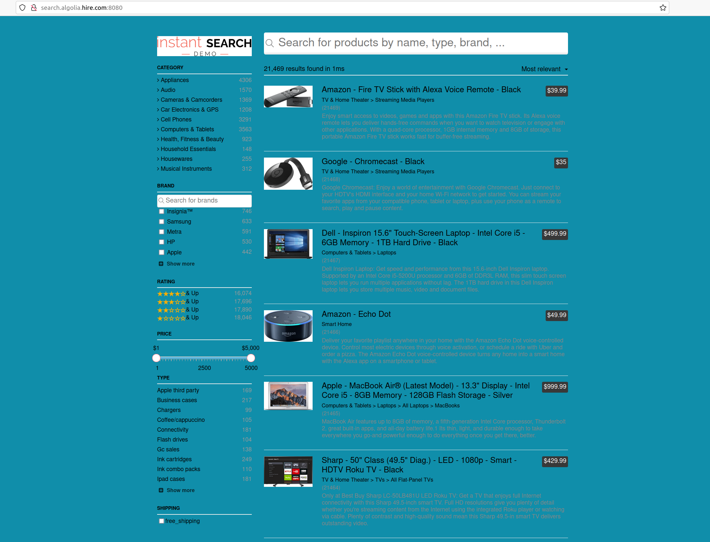
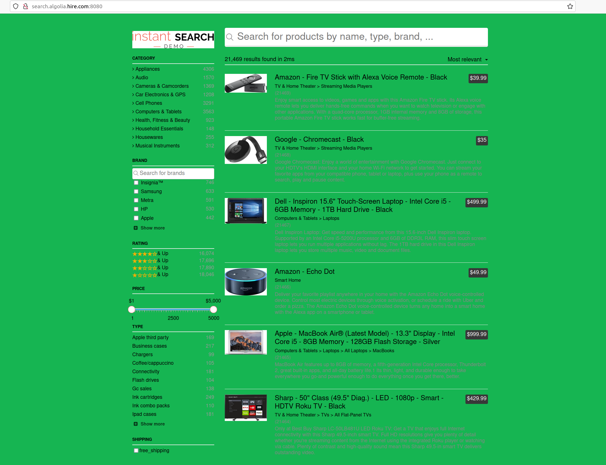

**Note:** this repository is hosting the demo that was previously located at [algolia/examples](https://github.com/algolia/examples/tree/master/instant-search/instantsearch.js/)

-----

Instant-Search Demo Enhanced
====================

The same sample project but enhanced

## Features +
* The simplest dockerfile of the world
* A simple multiarch Makefile
* A simple kubernetes manifest to ensure graceful handling of failures
* A k3s cluster with
  * Traefik Ingress
  * ArgoCD & Argo rollout for deployment and release

## Prerequisites

You need to have installed :

* Docker from docker ( you need buildx if you want to build image )
  * https://docs.docker.com/desktop/mac/install/
  * https://docs.docker.com/engine/install/ubuntu/
  

* Install Kubectl

On linux
```shell
sudo curl -sSL -o /usr/local/bin/kubectl "https://dl.k8s.io/release/$(curl -L -s https://dl.k8s.io/release/stable.txt)/bin/linux/amd64/kubectl"
sudo chmod +x /usr/local/bin/kubectl
```

On mac M1
```shell
sudo curl -sSL -o /usr/local/bin/kubectl "https://dl.k8s.io/release/$(curl -L -s https://dl.k8s.io/release/stable.txt)/bin/darwin/arm64/kubectl"
sudo chmod +x /usr/local/bin/kubectl
```

On mac Intel
```shell
sudo curl -sSL -o /usr/local/bin/kubectl "https://dl.k8s.io/release/$(curl -L -s https://dl.k8s.io/release/stable.txt)/bin/darwin/amd64/kubectl"
sudo chmod +x /usr/local/bin/kubectl
```

brew install kubectl

* Install Argo rollout Kubectl plugin

On Linux
```shell
sudo curl -sSL -o /usr/local/bin/kubectl-argo-rollouts https://github.com/argoproj/argo-rollouts/releases/latest/download/kubectl-argo-rollouts-linux-amd64
sudo chmod +x /usr/local/bin/kubectl-argo-rollouts 
```

On Mac
````shell
brew install argoproj/tap/kubectl-argo-rollouts
````

* Install ArgoCD cli

On Linux
```shell
sudo curl -sSL -o /usr/local/bin/argocd https://github.com/argoproj/argo-cd/releases/latest/download/argocd-linux-amd64
sudo chmod +x /usr/local/bin/argocd
```

On Mac
```shell
brew install argocd
```

* Add entry for demo purpose to your ```/etc/hosts```

```shell
echo  "127.0.0.1 search.algolia.hire.com" | sudo tee -a /etc/hosts
echo  "127.0.0.1 cd.algolia.hire.com" | sudo tee -a /etc/hosts
```

* <span style="color:red"> Shoot your MDM if you have one ( or be kind with him ) because it could be a problem with port binding, among other things. </span>
  
  * If you can't or if you have a problem with it please run into a VM with multipass for example or contact me for providing it


* If you use Docker Desktop be sure that you disable kubernetes and restart it

## Get the project (if you want to see it or build it)

```sh
git clone git clone git@github.com:mdecalf/instant-search-demo-enhanced.git
cd instant-search-demo-enhanced
```

## Build application (if you want or use image below)

```sh
export IMAGE=<YOUR_IMAGE_NAME>
export TAG=<DESIRED_TAG>
# Make sure you have done a docker login
export DOCKER_REPO=<YOUR_DOCKER_REPO>

make image
```

## Install k3d

On Linux
```shell
sudo curl -sSL -o /usr/local/bin/k3d https://github.com/rancher/k3d/releases/download/v5.3.0/k3d-linux-amd64
```

On Mac M1
````shell
sudo curl -sSL -o /usr/local/bin/k3d https://github.com/rancher/k3d/releases/download/v5.3.0/k3d-darwin-arm64
````

On Mac Linux
```shell
sudo curl -sSL -o /usr/local/bin/k3d https://github.com/rancher/k3d/releases/download/v5.3.0/k3d-darwin-amd64
```

## Launch k3d cluster
```shell
k3d cluster create algolia --agents 2 --servers 1 --api-port 6443 -p "8080:80@loadbalancer" -p "8443:443@loadbalancer" --image rancher/k3s:v1.21.9-k3s1
```

## Install argocd and argo rollout

```shell
kubectl create namespace argo-rollouts
kubectl apply -n argo-rollouts -f https://github.com/argoproj/argo-rollouts/releases/latest/download/install.yaml

kubectl create namespace argocd
kubectl apply -n argocd -f https://raw.githubusercontent.com/argoproj/argo-cd/stable/manifests/install.yaml

# Terrible hack for avoid ssl passthrough problem, sorry
cat <<EOF | kubectl -n argocd patch deployment argocd-server --patch '
{
  "spec": {
    "template": {
      "spec": {
        "containers": [
          {
            "name": "argocd-server",
            "command": [
              "argocd-server",
              "--repo-server",
              "argocd-repo-server:8081",
              "--insecure"
            ]
          }
        ]
      }
    }
  }
}'
EOF

cat <<EOF | kubectl -n argocd apply -f -
apiVersion: networking.k8s.io/v1
kind: Ingress
metadata:
  name: argocd-server-http-ingress
  namespace: argocd
  annotations:
    nginx.ingress.kubernetes.io/force-ssl-redirect: "true"
    nginx.ingress.kubernetes.io/backend-protocol: "HTTP"
spec:
  rules:
  - host: cd.algolia.hire.com
    http:
      paths:
      - path: /
        pathType: Prefix
        backend:
          service:
            name: argocd-server
            port:
              number: 80
  tls:
  - hosts:
    - cd.algolia.hire.com
    secretName: argocd-secret
EOF
```

## Login to Argocd

Wait for container creating

You can access to the UI through [cd.algolia.hire.com](https://cd.algolia.hire.com:8443)

Get admin password

```shell
kubectl -n argocd get secret argocd-initial-admin-secret -o jsonpath="{.data.password}" | base64 -d; echo
```

You can connect through the UI with user admin and the password above ( maybe you need refresh page at login )

Connect with argocd cli

```shell
# use password provided below
argocd login --insecure --grpc-web cd.algolia.hire.com:8443 --username admin
```

## Deploy application

For the purpose of this demo one image with two tags **green** and **blue** were pushed on dockerhub [acronys/instant-search-demo-enhanced](https://hub.docker.com/repository/docker/acronys/instant-search-demo-enhanced)

```shell
kubectl create ns algolia-search

argocd app create search-app-rollout \
  --repo https://github.com/mdecalf/instant-search-demo-enhanced.git \
  --path deployments \
  --dest-namespace algolia-search \
  --dest-server https://kubernetes.default.svc \
  --revision blue

argocd app sync search-app-rollout
```

After that, an argocd application is created and deployed on our namespace

You can see the rollout app with

```shell
# Verify that your application is deployed with argo rollout
kubectl argo rollouts -n algolia-search get rollout search-app-rollout --watch
```

## Access the app

You can access app through [http://search.algolia.hire.com:8080](http://search.algolia.hire.com:8080) or [https://search.algolia.hire.com:8443](https://search.algolia.hire.com:8443) on your browser

It's the blue version for the purpose of this demo



## Hurt the app

By design our application is replicated and load balanced so you can delete a pod it will be recreated

```shell
# Get the pods and choose one or more
kubectl -n algolia-search get  po

# Delete a chosen pod
kubectl -n algolia-search delete po <YOUR_VICTIM>

# It will be re-created again and again
kubectl -n algolia-search get  po 
NAME                                  READY   STATUS              RESTARTS   AGE
search-app-rollout-6d459b5df6-8gn69   1/1     Running             1          11h
search-app-rollout-6d459b5df6-7wxx5   1/1     Running             1          11h
search-app-rollout-9c56c956f-x67lp    1/1     Running             1          11h
search-app-rollout-6d459b5df6-frvl6   1/1     Running             1          11h
search-app-rollout-6d459b5df6-r5cn8   0/1     ContainerCreating   0          2s
search-app-rollout-6d459b5df6-2r6c2   0/1     Terminating         0          15s
```

## Deploy a new revision and rollback through Canary release

Now we want to deploy a new revision of our app the **green** release. For the purpose of this demo we will use a command instead of real CD pipeline
```shell
argocd app patch search-app-rollout --patch '{"spec": { "source": { "targetRevision": "green" } }}' --type merge
argocd app sync search-app-rollout
```

Go to the Argocd UI or use argo rollout command 

```shell

kubectl argo rollouts -n algolia-search get rollout search-app-rollout --watch

# OUTPUT
Name:            search-app-rollout
Namespace:       algolia-search
Status:          ॥ Paused
Message:         CanaryPauseStep
Strategy:        Canary
Step:          1/8
SetWeight:     20
ActualWeight:  20
Images:          acronys/instant-search-demo-enhanced:blue (stable)
acronys/instant-search-demo-enhanced:green (canary)
Replicas:
Desired:       5
Current:       5
Updated:       1
Ready:         5
Available:     5

NAME                                            KIND        STATUS     AGE  INFO
⟳ search-app-rollout                            Rollout     ॥ Paused   38m  
├──# revision:8                                                             
│  └──⧉ search-app-rollout-9c56c956f            ReplicaSet  ✔ Healthy  36m  canary
│     └──□ search-app-rollout-9c56c956f-l48rq   Pod         ✔ Running  24s  ready:1/1
└──# revision:7                                                             
└──⧉ search-app-rollout-6d459b5df6           ReplicaSet  ✔ Healthy  38m  stable
├──□ search-app-rollout-6d459b5df6-gwfrj  Pod         ✔ Running  95s  ready:1/1
├──□ search-app-rollout-6d459b5df6-m8k6j  Pod         ✔ Running  67s  ready:1/1
├──□ search-app-rollout-6d459b5df6-tms2q  Pod         ✔ Running  67s  ready:1/1
└──□ search-app-rollout-6d459b5df6-vlbdb  Pod         ✔ Running  67s  ready:1/1
```

Now if you on your browser on the app tab do ```CTRL+F5``` or ```⌘ + Maj + R``` on mac ( important because I only change css color ...)

As you can see every 5 reload you got the green release. It corresponds at 20% of pods that is the first step of our rollout release




**Are you happy with the green release ? If yes do**

```shell
kubectl argo rollouts -n algolia-search promote search-app-rollout --full
```

After few seconds you will get 100% of call on the green release

**Finally you prefer the blue release ?**

If you haven't done full rollout command above you can do

```shell
kubectl argo rollouts  -n algolia-search abort search-app-rollout
```

If you done full rollout command you can specify an old revision like this

```shell
kubectl argo rollouts -n algolia-search undo search-app-rollout --to-revision=1
```

## Uninstall the demo

Cause I'm nice, find below the uninstall command of our demo

```shell
k3d cluster delete multinode algolia

sudo rm -rf /usr/local/bin/argocd
sudo rm -rf /usr/local/bin/kubectl
sudo rm -rf /usr/local/bin/kubectl-argo-rollouts 
sudo rm -rf /usr/local/bin/k3d
```
Remove entry in your /etc/hosts

## For further

* Use CI tools like gitlab CI or github action instead of Readme
* Use separate git repo for deployment with kustomize
* Use git commit/branch instead of patching ArgoCD project based on git release
* Add a real cert for ingress